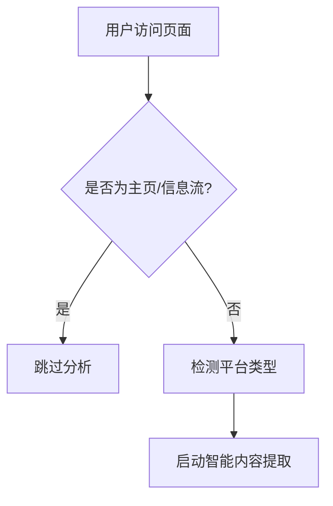
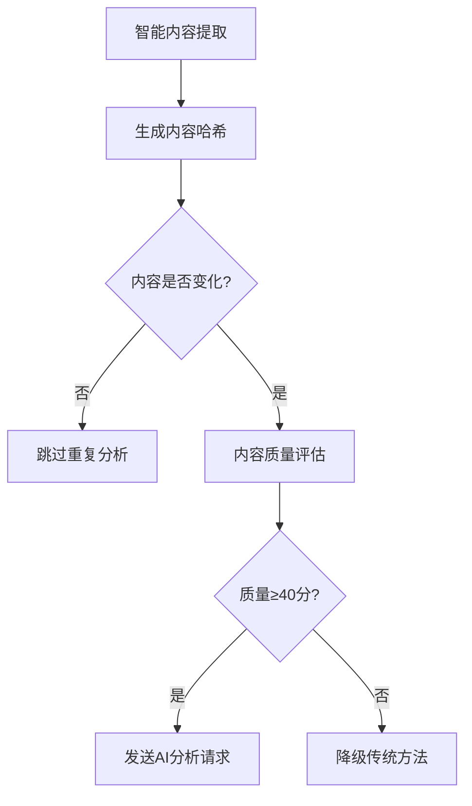
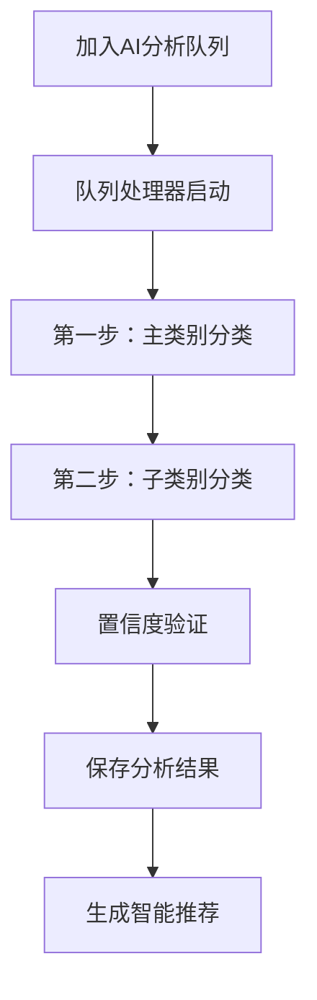
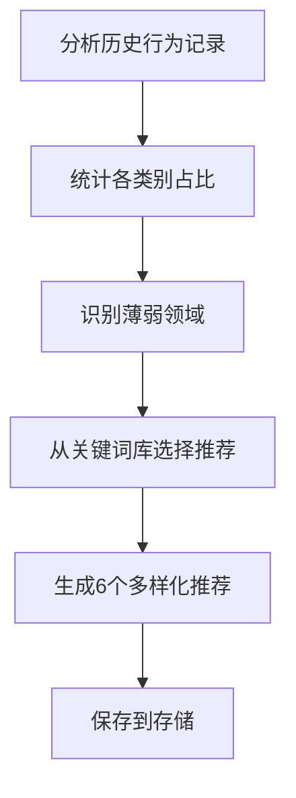

# 🚀 信息茧房破除插件 - AI智能版

> 基于AI的智能内容分类，帮助用户破除信息茧房，获取多样化内容推荐

[](https://chrome.google.com/webstore)
[](https://github.com/YunfanGoForIt/information-cocoon-breaker2---ai)
[](https://github.com/YunfanGoForIt/information-cocoon-breaker2---ai)

## 📖 项目简介

信息茧房破除插件是一款基于人工智能的Chrome浏览器扩展，通过智能分析用户浏览的内容，识别兴趣偏好，主动推荐不同领域的优质内容，帮助用户打破信息茧房，实现视野拓展和思维多元化。

## 🏗️ 核心架构

### 📋 核心模块结构

```
信息茧房破除插件
├── 🎛️ background.js          # 主控制器 & AI分析引擎
├── 📱 content.js             # 内容脚本 & 页面分析器
├── 🔍 content-extractor.js   # 智能内容提取器
├── 🤖 ai-classifier.js       # AI分类器（内联）
├── 🌐 api-client.js          # API客户端（内联）
├── 📋 category-schema.js     # 分类体系定义（内联）
├── 🎨 popup.html/js          # 用户界面
└── ⚙️ options.html/js        # 设置页面
```

## 🧠 核心逻辑分析

### 🎯 Background.js 核心功能

#### 1. **队列化AI分析系统**
```javascript
// AI分析队列系统
const analysisQueue = [];
let isQueueProcessorRunning = false;

// 队列处理流程
添加到队列 → 队列处理器 → AI分析 → 结果保存 → 推荐生成
```

**主要特点：**
- ✅ 异步队列处理，避免API限流
- ✅ 自动重试机制（最多3次）
- ✅ 降级策略（AI失败时使用传统方法）
- ✅ 超时控制（60秒）

#### 2. **两步式AI分类算法**
```javascript
// 第一步：主类别分类（8大类）
科技创新 | 文化艺术 | 科学探索 | 社会人文 | 
生活方式 | 教育成长 | 商业财经 | 娱乐休闲

// 第二步：子类别细分（32个子类）
每个主类别 × 4个子类别 = 32个精确分类
```

**核心优势：**
- 🎯 先粗分再细分，提高准确性
- 📊 置信度评估，确保结果可靠
- 🔄 结果验证和备用分类机制

#### 3. **智能推荐生成算法**
```javascript
// 推荐生成逻辑
分析兴趣分布 → 识别薄弱领域 → 生成多样化推荐
```

**推荐策略：**
- 📈 统计用户各类别浏览占比
- 🎯 重点推荐占比低于30%的类别
- 🎲 从关键词库中随机选择具体内容
- 💡 最终输出6个多样化关键词推荐

### 📱 Content.js 核心功能

#### 1. **智能页面检测与过滤**
```javascript
// 页面分类逻辑
主页/信息流页面 → 跳过分析
静态内容页面 → 执行分析
动态内容变化 → 实时分析
```

**检测策略：**
- 🏠 自动识别并跳过主页/信息流（避免无效分析）
- 📄 精确定位内容页面（视频、帖子、文章等）
- 🔄 URL变化监听（支持单页应用）

#### 2. **防重复分析机制**
```javascript
// 去重机制
const analysisState = {
  lastAnalyzedUrl: '',      // 最后分析的URL
  lastContentHash: '',      // 内容哈希值
  analysisInProgress: false, // 分析进行标志
  isStaticPage: false       // 静态页面标记
};
```

**防重复策略：**
- 🔗 URL变化检测
- 📝 内容哈希对比
- ⏳ 分析状态锁定
- 📄 静态页面标记（避免重复分析同一内容）

#### 3. **多平台内容提取**
```javascript
// 支持平台
douyin.com      → 抖音视频分析
xiaohongshu.com → 小红书笔记分析  
kuaishou.com    → 快手短视频分析
youtube.com     → YouTube视频分析
tiktok.com      → TikTok内容分析
```

**提取特点：**
- 🎯 平台特定选择器优化
- 📊 内容质量评估（≥40分才进行AI分析）
- 🏷️ 自动降级到传统标签提取

## 🔄 完整工作流程

### 1. **内容检测阶段**


### 2. **内容分析阶段**


### 3. **AI分析阶段**


### 4. **推荐生成阶段**


## ✨ 技术特色

### 🚀 **性能优化**
- **队列化处理**: 避免API并发冲突，确保稳定性
- **智能缓存**: 避免重复分析，提升响应速度  
- **防抖机制**: 页面变化检测采用500ms防抖
- **超时控制**: 60秒AI分析超时，自动降级

### 🎯 **精准分析**
- **两步分类法**: 先粗分8大类，再细分32子类
- **内容质量评估**: 只对高质量内容进行AI分析
- **置信度验证**: 确保分类结果的可靠性
- **多层降级**: AI失败时自动切换传统方法

### 🛡️ **稳定性保障**
- **错误处理**: 完善的异常捕获和错误恢复
- **状态管理**: 防重复分析和状态冲突
- **扩展上下文检查**: 避免扩展失效导致的错误
- **自动重试**: 分析失败时最多重试3次

## 🔧 快速开始

### 安装配置

1. **克隆项目**
```bash
git clone https://github.com/YunfanGoForIt/information-cocoon-breaker2---ai.git
```

2. **Chrome扩展安装**
   - 打开 `chrome://extensions/`
   - 启用"开发者模式"
   - 点击"加载已解压的扩展程序"
   - 选择项目文件夹

3. **API配置**
   - 点击插件图标进入设置
   - 配置智谱GLM-4.5 API密钥
   - 调整推荐敏感度（30%-90%）

### 使用方法

1. **正常浏览**: 访问支持的平台（抖音、小红书等）
2. **自动分析**: 插件自动识别并分析内容页面
3. **查看结果**: 点击插件图标查看分析结果和推荐
4. **多样化探索**: 根据推荐内容拓展兴趣领域

## 🔍 调试功能

插件提供了强大的调试功能，在浏览器控制台中可用：

```javascript
// 清除AI缓存
clearAICache()

// 测试AI分类功能  
testAIClassification()

// 查看队列状态
chrome.runtime.sendMessage({action: "getQueueStatus"})

// 查看AI系统状态
chrome.runtime.sendMessage({action: "getAISystemStatus"})
```

## 📊 数据流程

### 存储结构
```javascript
{
  userBehavior: [],           // 用户行为记录（最多100条）
  recommendations: [],        // 智能推荐内容
  diversityScore: 0,         // 多样性分数
  thresholdPercentage: 70,   // 提醒阈值
  aiApiConfig: {},           // AI配置
  classificationStats: {}    // 分类统计
}
```

### AI分类结果格式
```javascript
{
  mainCategory: {
    id: "technology",
    name: "科技创新", 
    confidence: 0.85
  },
  subCategory: {
    id: "ai_tech",
    name: "AI技术",
    confidence: 0.92
  },
  overallConfidence: 0.885,
  classificationPath: "科技创新 > AI技术",
  method: "ai_two_step"
}
```

## 🎯 智能推荐示例

基于用户行为分析，插件会生成如下推荐：

```javascript
// 如果用户主要浏览科技内容，可能推荐：
[
  "故宫文物修复视频",      // 文化艺术类
  "心理咨询实用技巧",      // 社会人文类  
  "家常菜制作教程",        // 生活方式类
  "创业经验分享案例",      // 商业财经类
  "量子物理实验演示",      // 科学探索类
  "高效学习方法实操"       // 教育成长类
]
```

## 🛠️ 开发配置

### 环境变量
```javascript
const DEV_DEFAULT_CONFIG = {
  enabled: true,
  apiConfig: {
    apiKey: "your-api-key",    // 开发API密钥
    model: "glm-4.5",          // 模型版本
    temperature: 0.6,          // 创造性参数
    timeout: 60000             // 超时时间
  }
};
```

### 支持的AI模型
- 智谱GLM-4.5 (主要支持)
- OpenAI GPT系列
- Claude系列  
- Google Gemini
- 百度文心一言
- 阿里通义千问

## 📈 性能指标

- **分析延迟**: < 3秒（队列处理）
- **准确率**: > 85%（基于置信度）
- **内存占用**: < 50MB
- **API调用**: 限频20次/分钟
- **存储空间**: < 5MB（本地存储）

## 🔒 隐私保护

- ✅ 所有数据仅在本地存储
- ✅ 不上传用户浏览记录  
- ✅ API调用仅发送内容摘要
- ✅ 可随时清除所有数据

---

⭐ **如果这个项目对您有帮助，请给我们一个Star！**

🔗 **项目地址**: https://github.com/YunfanGoForIt/information-cocoon-breaker2---ai